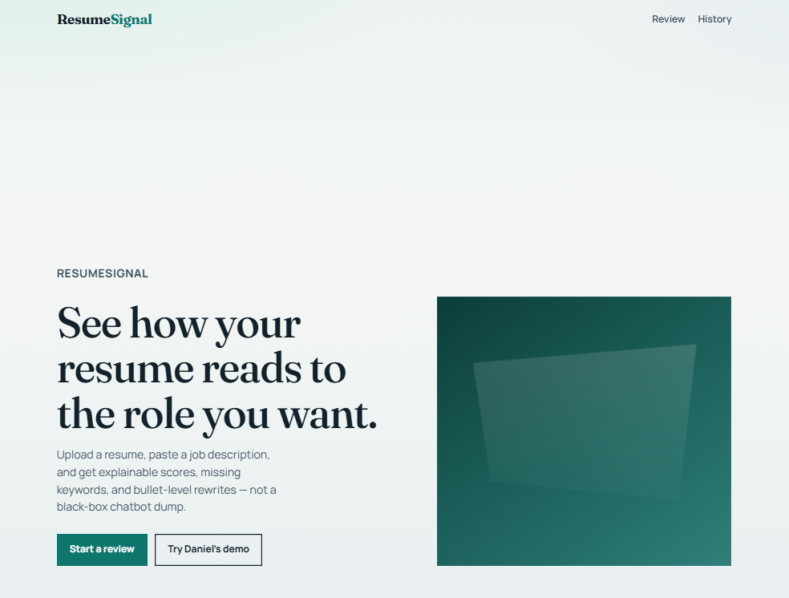
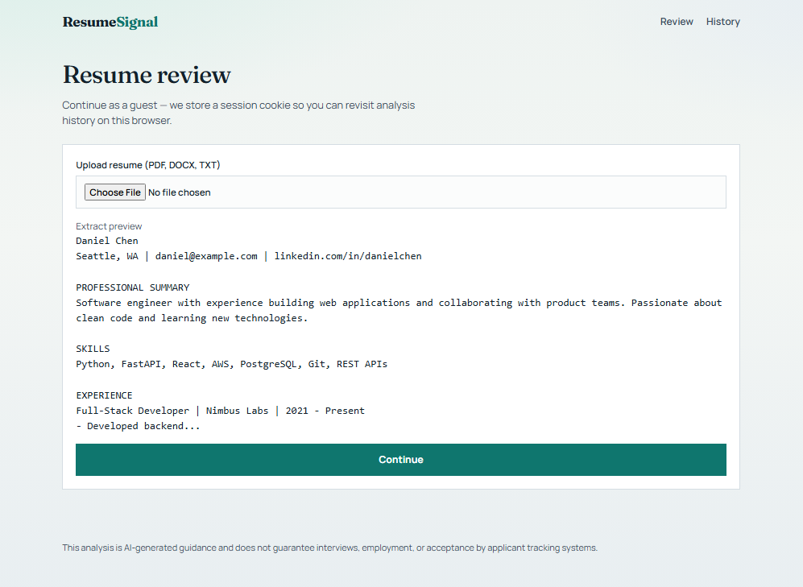
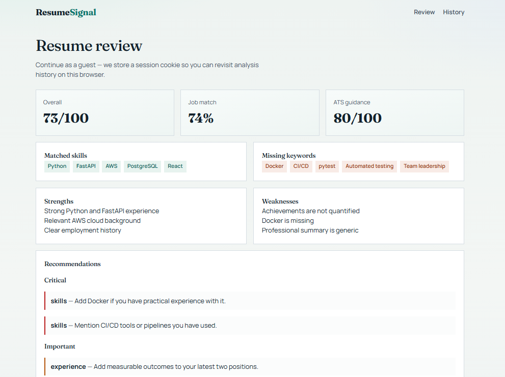
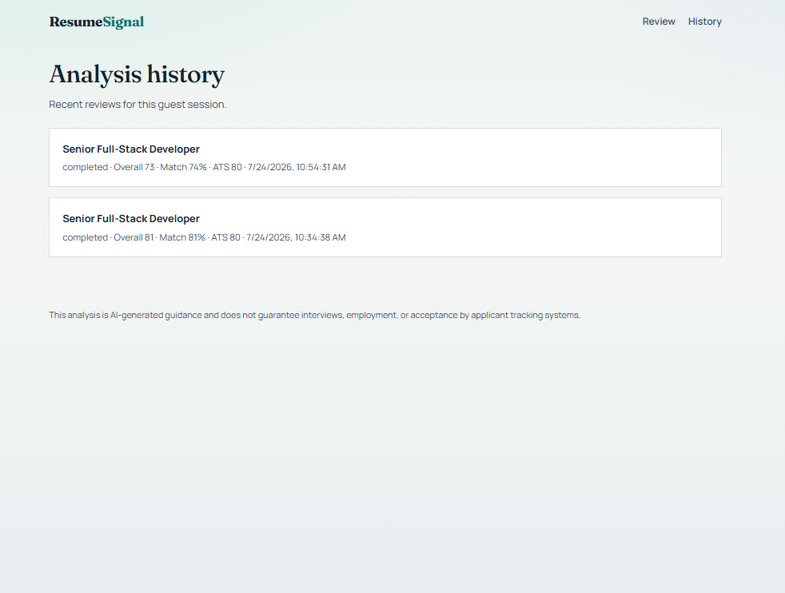

# ResumeSignal — AI Resume Reviewer

<p align="center">
  
</p>

<p align="center">
  <strong>Explainable AI resume review</strong> — scores, ATS guidance, keyword gaps, and bullet rewrites<br/>
  against a real job description. Built as a portfolio sample with Next.js + FastAPI + PostgreSQL.
</p>

<p align="center">
  <a href="#screenshots">Screenshots</a> ·
  <a href="#quick-start-local-no-docker">Quick start</a> ·
  <a href="#architecture">Architecture</a> ·
  <a href="#api">API</a>
</p>

---

## Screenshots

| Landing | Upload & extract |
| --- | --- |
|  |  |

| Score dashboard | Analysis history |
| --- | --- |
|  |  |

---

## What it does

Upload a resume (PDF / DOCX / TXT), paste an optional job description, and get:

- **Overall / job match / ATS** scores from a transparent category model (not one opaque LLM number)
- Matched skills and missing keywords
- Prioritized recommendations (Critical / Important / Optional)
- Single-bullet rewrites with before/after
- Markdown export and guest analysis history

Includes a one-click **Daniel demo** storyline for portfolio walkthroughs.

> This analysis is AI-generated guidance and does not guarantee interviews, employment, or acceptance by applicant tracking systems.

---

## Architecture

```text
Next.js Frontend
      ↓
FastAPI Backend
      ↓
Resume Processing → LLM Provider Adapter → Scoring Engine
      ↓                      ↓
 PostgreSQL           Ollama / OpenAI / Anthropic
      ↓
Storage Adapter → local disk or AWS S3
```

**Env switchable:**

| Knob | Values |
| --- | --- |
| `LLM_PROVIDER` | `ollama` (default), `openai`, `anthropic` |
| `STORAGE_BACKEND` | `local` (default), `s3` |

If the LLM provider is unreachable, the backend falls back to a deterministic mock so demos still work.

---

## Features (MVP)

- Upload PDF / DOCX / TXT resumes
- Paste optional job description + target role / level
- Structured category scores (content, relevance, achievements, skills, readability, ATS)
- Matched skills, missing keywords, prioritized recommendations
- Rewrite a single bullet (before/after)
- Markdown export + analysis history
- Delete uploaded resume data
- Guest session via cookie
- Background analysis + polling (avoids proxy timeouts on slow local models)

---

## Quick start (local, no Docker)

### 1. Backend

```bash
cd backend
python -m venv .venv

# Windows PowerShell
.\.venv\Scripts\Activate.ps1

pip install -r requirements.txt
# Quick local demo without Postgres:
# set DATABASE_URL=sqlite:///./dev.db

uvicorn app.main:app --reload --port 8000
```

Use **Python 3.12+ 64-bit** (or 3.14 64-bit) so `psycopg2-binary` / `greenlet` install from wheels.

### 2. Frontend

```bash
cd frontend
npm install
# API calls use same-origin /api and Next.js rewrites to the backend
# Optional: set API_PROXY_TARGET=http://localhost:8000
npm run dev
```

Open http://localhost:3000

### 3. LLM providers

Copy [`.env.example`](.env.example) and set:

| Variable | Values |
| --- | --- |
| `LLM_PROVIDER` | `ollama` (default), `openai`, `anthropic` |
| `OLLAMA_BASE_URL` / `OLLAMA_MODEL` | e.g. `http://localhost:11434`, `llama3.1` |
| `OPENAI_API_KEY` / `OPENAI_MODEL` | when using OpenAI |
| `ANTHROPIC_API_KEY` / `ANTHROPIC_MODEL` | when using Anthropic |

```bash
ollama pull llama3.1
```

### 4. Storage

| Variable | Values |
| --- | --- |
| `STORAGE_BACKEND` | `local` (default) or `s3` |
| `UPLOAD_DIR` | local folder |
| `AWS_S3_BUCKET`, `AWS_REGION`, keys | required for S3 |

---

## Docker Compose

```bash
cp .env.example .env
docker compose up --build
```

- Frontend: http://localhost:3000
- API: http://localhost:8000/api/health
- Postgres: `localhost:5432`

Optional Ollama service profile:

```bash
docker compose --profile ollama up --build
```

---

## Demo story (Daniel)

1. Open **Try Daniel's demo** on the landing page
2. Upload the prefilled mid-level Python resume
3. Keep the Senior Full-Stack JD (mentions Docker, CI/CD, etc.)
4. Run analysis — expect strong Python/FastAPI/AWS matches and missing Docker/CI/CD
5. Rewrite `Developed backend APIs using FastAPI.` into a quantified bullet
6. Export the Markdown report

Sample fixtures live in [`fixtures/`](fixtures/).

---

## API

| Method | Path |
| --- | --- |
| GET | `/api/health` |
| POST | `/api/resumes/upload` |
| GET | `/api/resumes/{id}` |
| DELETE | `/api/resumes/{id}` |
| POST | `/api/job-descriptions` |
| POST | `/api/analyses` |
| GET | `/api/analyses` |
| GET | `/api/analyses/{id}` |
| GET | `/api/analyses/{id}/export` |
| POST | `/api/rewrites` |

---

## Scoring model

Backend clamps and sums category scores:

| Category | Max |
| --- | --- |
| Content quality | 25 |
| Job relevance | 25 |
| Achievements | 15 |
| Skills match | 15 |
| Structure / readability | 10 |
| ATS compatibility | 10 |
| **Total** | **100** |

---

## Safety

The system does not score age, gender, race, nationality, religion, photo, marital status, or disability. Sensitive fields are stripped from structured parses.

---

## Tests

```bash
cd backend
pip install -r requirements.txt
pytest
```

---

## Project layout

```text
/
├── frontend/          Next.js App Router + Tailwind
├── backend/           FastAPI + SQLAlchemy + Alembic
├── fixtures/          Demo resume + JD
├── shots/             README screenshots
├── docker-compose.yml
└── .env.example
```

---

## Stack

- **Frontend:** Next.js 15, TypeScript, Tailwind
- **Backend:** FastAPI, SQLAlchemy, Alembic
- **DB:** PostgreSQL (SQLite supported for quick demos)
- **LLM:** Ollama / OpenAI / Anthropic (env switch)
- **Storage:** Local disk or AWS S3 (env switch)
